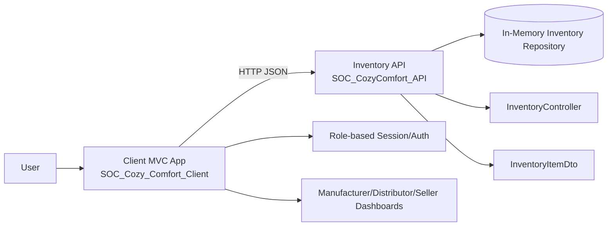
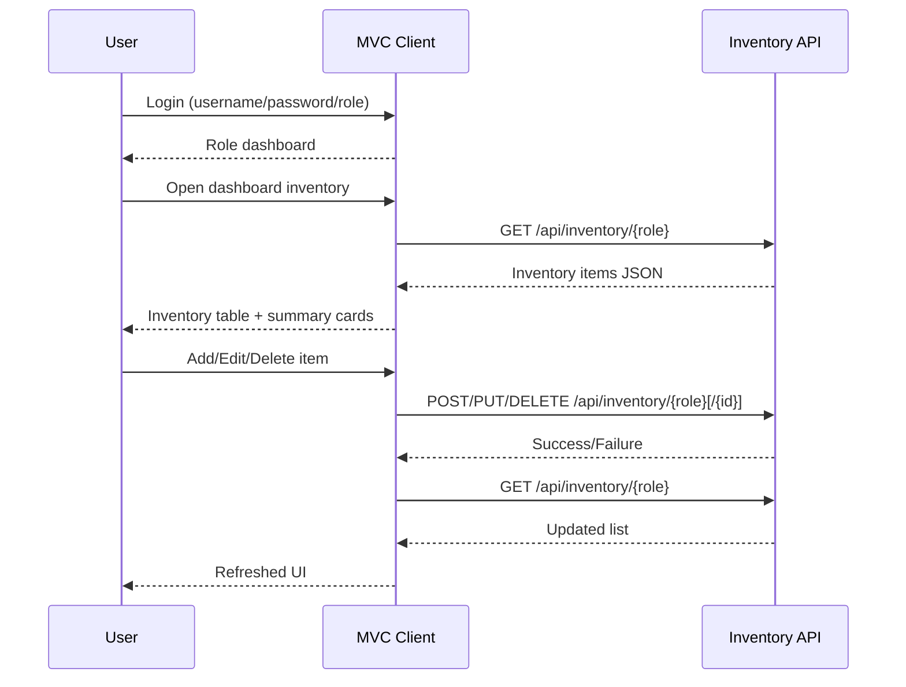
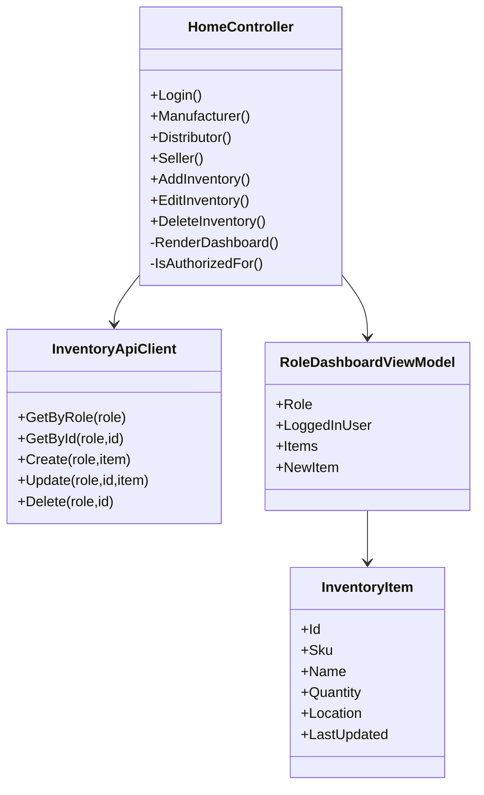
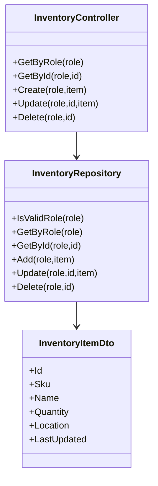

# Architecture & Design Diagrams

## 1) High-Level SOC Component Diagram

## 2) Role Flow Diagram (Login to CRUD)

## 3) Client Logical Design

## 4) API Logical Design

## 5) Maintainability & Reusability Design Decisions
- Service interaction is centralized in `InventoryApiClient`.
- API CRUD is centralized in a single controller + repository.
- Role-aware behavior is consolidated through helper methods (`RenderDashboard`, `IsAuthorizedFor`).
- View models separate UI concerns from transport DTOs.
- Config-driven API base URL allows environment portability without code changes.
