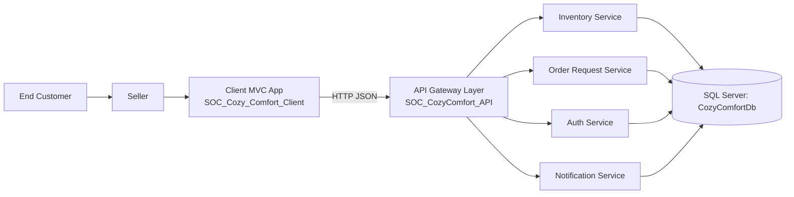
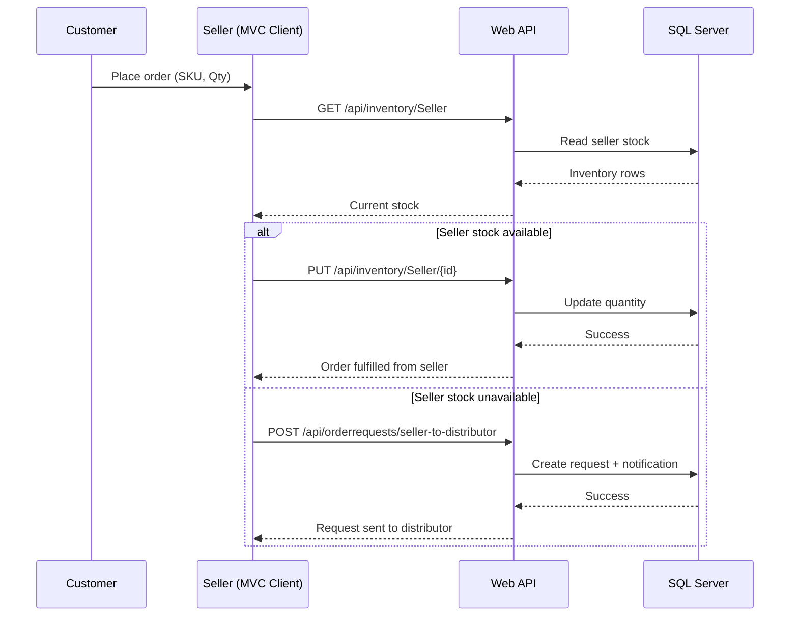
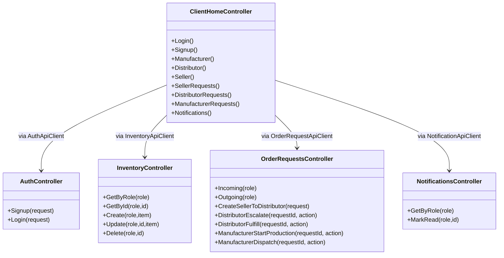

# Architecture & Design Diagrams (Updated for Submission)

## 1) High-Level SOC Component Diagram

## 2) Service Interaction Flow (Seller Shortage Scenario)

## 3) Logical Service Design

## 4) Data Design (Core Tables)
- `Roles` (`Id`, `RoleName`)
- `Users` (`Id`, `UserName`, `Password`, `RoleId`) + optional schema extension support handled safely by signup logic
- `InventoryItems` (`Id`, `RoleName`, `Sku`, `Name`, `Quantity`, `Location`, `LastUpdated`)
- `OrderRequests` (`Id`, `RequestType`, `RequestedByRole`, `RequestedToRole`, `RequestedByUser`, `Sku`, `BlanketName`, `Quantity`, `Status`, `Notes`, timestamps)
- `Notifications` (`Id`, `RecipientRole`, `Title`, `Message`, `NotificationType`, `IsRead`, `RelatedRequestId`, `CreatedAt`)

## 5) Maintainability and Reusability Decisions
1. **Service boundaries by domain**: auth, inventory, requests, notifications are separated at controller/repository layer.
2. **Client adapters**: all API calls are centralized in service classes (`AuthApiClient`, `InventoryApiClient`, etc.), reducing duplication.
3. **Role isolation**: role checks are consistently enforced in client and API paths.
4. **Schema compatibility**: signup supports legacy DB schema safely while maintaining upgrade compatibility.
5. **Config-driven integration**: API base URL is externalized through configuration.

## 6) Scalability Notes
- API services can be scaled horizontally behind IIS/Web farm.
- Request-heavy endpoints (`/api/orderrequests/*`, `/api/inventory/*`) are independently optimizable.
- Database indexing can be extended on SKU, RoleName, and request status fields as usage grows.
